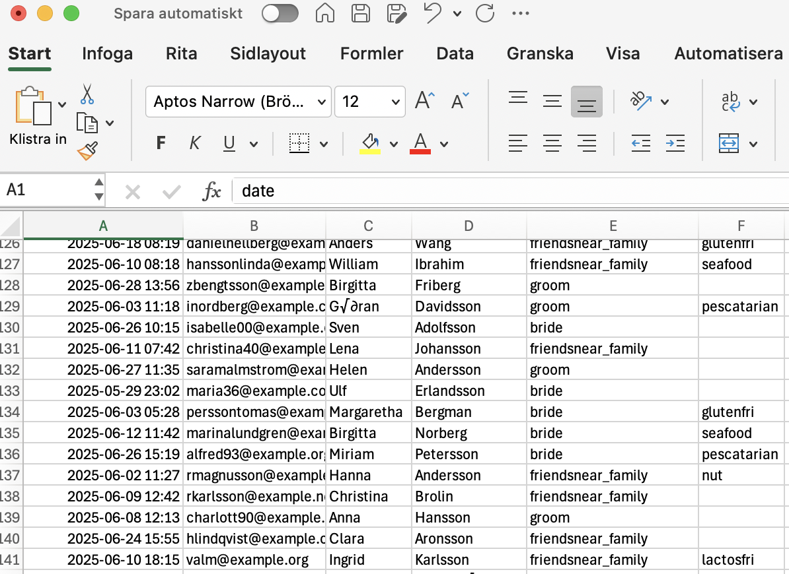
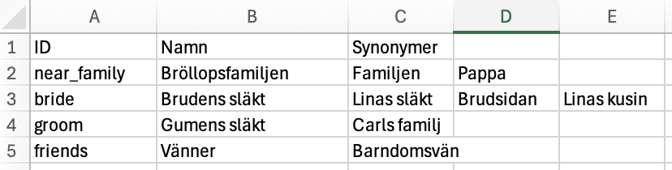

# An application to do table seatings in large meetings.
This application handles how to do table-seatings at big event.
It was written by Fredrik Johansson, first as a proof of concept, then as a more serious app. It's develpoment was pushed into existance when my department had to plan the company summerparty in 2025.

## What it does:
It reads in datafiles for *Persons*, *Departments* and *Tables*. Based on that data it can autoplace people at the tables based on the department they belong to.

You cant do that via Gui or though command line.
Both interfaces are supported.

## i18n Language:
As the app currently is mostly oriented to Swedish people, it does not have any internationalisation build in. Most strings in the GUI are written in Swedish.

Patches to support other i18n are of course welcome!

From here on I will use Swedish in this Readme.

# Svenska
Detta är en applikation som jag skapade inför sommarfesten på skolan där jag jobbar. Vi behövde placera 156 personer vid 16 bord och platserna räckte precis. Vidare behövde vi prioritera så folk kunde sitta vid ihop med de arbetskamrater de normalt sätt umgås med.

Från början var det mer några snabbt ihopsatta script som genererade worddokument utifrån *.tsv filer. Numera är den mer förfinad och har i dagsläget 22k rader kod i projektet

### Om nuvarande app.
Nu är app mer förfinad och den har nu en GUI där man enklare kan se indata, göra placeringar och välja, samt skapa mallar för bordsplaceringskorten.

Som indata kräver den tre filer (kolumner inom parantes):
 - Personer (anm.datum, email, förnamn, efternamn, avdelning, specialkost)
 - Avdelningar (ID och namn)
 - Bord (ID och antal platser)

>Tanken är man hämtar in persondata via ett webbformulär, tex Google forms eller liknande, och exporterar datan till en fil.

### Filformat som stöds
Indata kan komma dessa format:
 - Excell *.xlsx.
   * Senaste aktiva flik läses in
 - Tabb separerad *.tsv
 - Semikolon separerad *.csv
 - Json (data exchage format)
   * Kräver rätt schema och kanske inte direkt är särkelit enkel att få till...

Se nedan för mer info om hur indatan skall struktureras.

>Tips! Se till att lägga in textfält i den ordningen i inbjudnings webbformuläret, så blir det i rätt ordning.

### Starta appen (Enkelt, icke nördigt)
**Windows**
Dubbelklicka på filen startme_unix.bat i appens mapp.

**Unix (macos, linux mfl)**
Dubbelklicka på filen startme_unix.sh i append mapp.

#### Det datatekniska sättet.
Sätt upp en virtual environment och installera via *pip install -r requirements.txt*

## GUI Appen
När man startar appen ser det ut så här. 

Vill man öppna ett tidigare projekt, gör så via arkiv menyn. Spara ändringar med Ctrl+S precis som vanligt.

### Projekt
För att få appen att hålla reda på ändringar och kunna öppna, spara stänga och öppna igen så används projekt. Så när du sparar i appen så sparar du bara de inställningar som du ändrat i projektet.

>I dagsläget har appen ingen möjlighet att ändra i indata filerna. För att ändra i dem, använd excell, eller annan avsedd editor.
Appen skall bevaka ändraringar i indata filerna och ladda om dem ifall det behövs.

## Gör så här för nytt projekt:
När du öppnat programmet så ger du namn till din fest/meet, väljer datum och tid.

Tex så här:


Spara sedan projektet:


Välj sedan indata filer genom trycka på knappen för det: 

Om du vill kan du välja en annan utdata mapp på samma vis. Kan göra det nklare att hålla reda på gerererade filer.

>### Spara!
>Glöm inte att spara projektet nu. (Arkiv->spara)

Nu kan du behöva trycka på läs om data. Om inte det funkar, prova att starta om programmet och öppna ditt tidigare sparade projekt.

### Exempeldata
Givet denna personindata:


Bord indata:


Avdelningar (Departments)


### Felvisning:
När det blir något fel vid laddning av data så visas det i felmeddelande kontrollen:


I detta fallet så har personfilen avdelningar som inte går att matcha med datan från avdelnings filen. Dessa visas som *unk* i persontabell vyn. (unk = unknown)


För att lösa detta problem så lägger du till dessa som synonymer i avdelningsfilen.
Tex:


När du laddat om så skall det visas rätt i persontabellen.


### Välja bordskort mall
Nu kan du välja mall för hur bordskorten skall se ut. Välj fliken för Namnbrickor, den ser ut så här:


Du kommer troligne vilja ha en annan mall, eller göra en egen. Klicka på knappen *Andra mallar*


Här har vi valt att använda mallen *Rustic*.
Klick på *OK*

Nu skall denna mallen användas istället.


Som du ser behöver vi flytta lite på texten, det gör vi i kontrollen för *Egenskaper*.

Vi behöver ändra *greet_text*, klicka upp dessa i trädvyn:


Flytta om textpositionerna och storlekarna som det passar, tex så här:


>**Spara!**

Nu ser min förhandsgranskning ut så här:


### Ändra backgrundsbild:
Du kan välja en annan bakgrundsbild, men den måste spras till samma mapp som mall template filen. Dvs i normalfallet kan du isåfall behöva spara denna namecard som en mall i en ann mapp.
Därefter sparan ned en ny png bild att ha som bakgrund, därefter byta png bild i egenskapskontrollen.

### Placera vid borden
Klicka på placeringsfliken, ännu så länge skall alla personer vara oplacerade.


Man kan följa hur många personer i kontrollen för *Antal att placera*

Här kan man välja att placera varje person manuellt, men enklast är att automatplacera, och sedan ändra de få personer man behöver flytta.

Klicka på automatplacera knappen


>Här ser man hur många platser det finns vid respektive bord, samt hur många lediga platser det är vid dem. Här är det enbart bord 11 och 15 som har varsin ledig plats.

Klicka på pilen för Bord 1 så ser du att automatplaceringen har prioriterat Bord 1 till närmaste familjen, precis som vi specificerade i indatafilen för borden, likaså bord 15.
Bord 16 och 17 är prioriterade till vänner.

**Spara!**

### Generera word-filer
När alla personer är placerade kan vi generera word-dokument med placeringkort, bordslista och specialkost för respektive bord.

Det gör du med knapparna för respektive funktion.

Att generera bordsplaceringskorten tar några sekunder så snälla vänta!..

När det är klar får du upp en länk-knapp som öppnar den skapade filen. Annars går det hitta filen i utdatamappen.


Klickar man på länken skall appen egentligen öppna en webläsare som i sin tur öppnar word (eller libreoffice), iallafall är det tänkt så. Hur det blir på just din dator beror på hur inställningarna för mimetyper är på just din dator.

>Funkar inte länken: öppna dokumentet via en vanlig filhanterare.

Så här ser det ut på min dator:


### Placeringslistor
För att generera bordsplaceringslistor klicka knappen för det, hos mig blev det så här:


Detta är defaultmallen. Du vill förmodligen ändra detta. För att få fina placeringslistor att lägga vid borden kan man skapa en word-fil med sidhuvud och sidfot som du vill ha dem. För att att lägga till din egna wordfil som mall väljer du du rätt fil:


>Jag gjorde en en ny mall där jag också ändrade formatmallen till att använda ett annat typsnitt inuti word.

Klickar på *Placeringslista mall* och väljer:


Nu blir det så här istället:


De fomatmallar jag ändrade i word var Normal, Rubrik, Rubrik 1 och Rubrik 2. Jag lade också in bilder i sidhuvud och sidfot. Lade också in en vattenstämpel rundad rektangel. Eftersom bilder i vattenstämpel följer mer varje sida så passar det in här.

### Specialkost
På samma vis kan man få ut en specialkost lista ur appen. 

Men här finns det ingen speciell mall att välja. En lista med specialkost har väl inte samma krav på snygghet som en bordsplaceringslista.

### Flytta på personer från bord
Vill man flytta på en person så måste det finnas plats vid bordet. I det här fallet finns det ju vid bord 11 och 15. 


# Indata
Alla data filer behöver ha en viss struktur.
 - Översta raden används som kolumner
   * Inte som indata.
 - Det måste finnas rätt antal kolumner

## Kolumnstruktur i personfil
| registr.datum | email | förnamn | efternamn | avdelning | *specialkost |
|---------------|-------|---------|-----------|----------|--------------|
| 2025-06-28 | name@example.com | Kjell | Andersson | Firman | gluten |
| ...  |

Specialkost är frivillig kolumn


## Kolumnstruktur i avdelningar
| ID | namn | *Synonym 1 | *Synonym 2 | ... |
|----|------|-----------|-----------|-----|
| ft | Fordon och transport | Bil | Körkort |
| ...  |

Synonym kolumnerna används för att matcha indata från personfilen till rätt avdelning. Det är inget krav att de finns. Har man tagit in datan via listval istället för fritext, så behövs det förmodligen inte.

## Kolumnstruktur i avdelningar
| Bordnamn | Antal platser | *Prioritera till avdelning |
|----------|---------------|---------------------|
| Bord 1 | 22 | ft |
| ...  |

Här är kolumn 3, prioritera till avdelning, frivillig. Om det finns värde i denna kolumn så kommer peroner från den avdelningen prioriteras dit.

# Installera
Denna app är skriven i python, testad på macos med py3.13. Den bör fungera från och med py3.10

Om du har en windows dator är det troligt att du själv måste installera python via Microsoft store.

>Det skall vara ofarligt att installera där ifrån, till skillnad från nedladdat från webben.

När det är klart måste du installera lite beroenden som koden behöver, tex för att öppna och skriva *xlsx* och *docx* filer.

För att installera automatiskt är det enklast via kommandoraden. Jag har skapat ett bash script som fixar det automatiskt.

Från projektmappen:
```bash
./autosetup.sh
```
Alternativt:
```bash
./autosetup.sh path/to/your/project.json
```
>Det krävs dock att scriptet har execute (körbarhets) behörighet.

### Manuell installation (det som scriptet gör)
Linux, macos med flera unix baserade:
```bash
python -m venv venv
source venv/bin/activate
pip install -r requirements.txt
python main.py
```
alternativt on den är döpt till python3:
```bash
python3 -m venv venv
source venv/bin/activate
pip3 install -r requirements.txt
python3 main.py
```

På windows:
```powershell
py -m venv venv
venv/Scripts/activate
pip install -r requirements.txt
py main.py
```

# Avancerat

## Filtera specialkost
Ibland kommer det meningslösa svar i rutan specialkost, som: nej, nope, inga, --, nada osv.

Några av dessa filteras bort baserat.
Det finns i dagsläget inget sätt att ändra dessa filter ord via GUI, men det går göra direkt i projektfilen. De finns under objectet "nope_expressions" i projekt filen.

```json
   ...
   "persons" : {
      ...
      "nope_expressions": ["no", "nada", ... ]
      ...
   }
```
Det kan vara en bra ide att ta en bakupkopia på projektfilen innan man ändrar i denna.
**OBS!!** Måste göras i en text editor, inte i word, wordpad eller liknande.

## Command line
Hela projektet började som Commandline scipts.
Man kan fortfarande köra det via detta.

Ange: *--no-gui* som växel på kommandoraden så körs appen utan GUI

Kommandoläge kan köras både med och utan en projektfil.

För mer info om vilka ingångs switchar som finns kör vanlig *--help* på kommandoraden.

# Bugrapporter
Som alla mjukvaror har denna också buggar.
Du får gärna rapportera dem via githubs bugrapportsystem.
